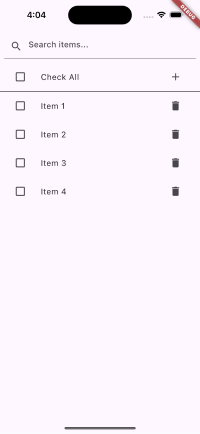

# 모바일 앱(Flutter)  포지션 과제

1. Item 추가를 구현합니다.
   1. `+` 아이콘을 누르면 Item을 추가합니다.
   2. 제목은 다음과 `Item` + `숫자` 의 조합입니다.
   3. 뒤에 숫자는 현재 존재하는 Item의 숫자 중 제일 큰 수 + 1 입니다.
   4. Item이 존재하지 않을 시에는 1로 시작합니다.
2. Item 삭제를 구현합니다.
   1. `휴지통` 아이콘을 누르면 해당 Item을 삭제합니다. 
3. Item Check On/Off를 구현합니다.
4. Check All을 구현합니다
   1. Check All 버튼이 On이 되었을 때 모든 Item의 Check가 On이 되어야 합니다.
   2. Check All 버튼이 Off이 되었을 때 모든 Item의 Check가 Off가 되어야 합니다.
   3. Item의 Check가 하나라도 Off가 된다면 Check All 버튼도 Off가 되어야 합니다.
   4. Item의 Check가 모두 On가 된다면 Check All 버튼도 On이 되어야 합니다.
5. Search Input을 입력하면 Item 제목에 대해서 검색 하여 Item 리스트가 보여야 합니다.

# PR 제출 시 포함 사항
> "코드를 명확하게 설명하는 커밋 메시지를 작성해 주세요. 기능성, 코드의 가독성, 그리고 모범 사례 준수 여부를 기준으로 평가할 예정입니다."
> "다양한 예외 사항들이 생길 수 있습니다. 고려할 수 있는 다양한 상황들을 생각해서 코드를 구현 바랍니다"
1. 각 항목 구현 소스 코드
    - Item 추가
    - Item 삭제
    - Item Check On/Off
    - Check All
    - Search
2. 과제 완료 후, fork한 레포지토리에서 작업을 완료하고 PR(Pull Request)로 제출해 주세요.

> 과제관련해 질문이 있다면 아래로 연락 부탁드립니다.
> 담당자 문의: dev@44labs.com

